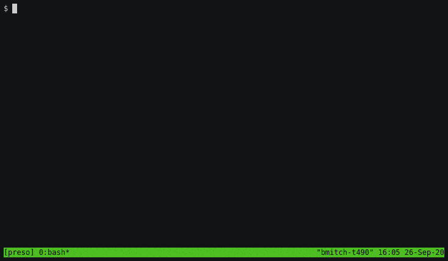

# regclient

Client interface for the registry API.
This includes `regctl` for a command line interface to manage registries.



## regctl Features

- Ability to inspect repo tags, manifests, and image configs without downloading
  the full image.
- Ability to copy or retag an image without pulling it into docker. Layers are
  only pulled if you are copying between different registries and the target
  registry does not have the layers already.
- Ability to export an image from a registry without a docker engine.
- Ability to delete an image manifest.
- Ability to delete a tag without removing the entire manifest.
- Uses docker registry logins and /etc/docker/certs.d by default to support
  private repositories and self signed registries.
- Shows current usage of Docker Hub's rate limit.

## regsync features

- Mirrors repositories or images based on a yaml configuration.
- Can use user's docker configuration for registry credentials.
- Ability to run on a cron schedule, one time synchronization, or only check
  for stale images.
- Ability to backup previous target image before overwriting.
- Ability to postpone mirror step when rate limit is below a threshold.
- Ability to mirror multiple images concurrently.

## Development Status

This project is in active development, a few features are not complete.
Unfinished or not yet started work includes:

- Ability to import images from a tar to a registry.
- Ability to export a multi-platform image.
- Ability to concurrently download layers.
- Ability to retry from a partial layer download.
- Documentation.
- Testing.

## Building

```shell
git clone https://github.com/regclient/regclient.git
cd regclient
go build -o regctl ./cmd/regctl/
```

## Downloading Binaries

Binaries are available on the [releases
page](https://github.com/regclient/regclient/releases).

The latest release can be downloaded using curl (adjust "regctl" and
"linux-amd64" for the desired command and your own platform):

```shell
curl -L https://github.com/regclient/regclient/releases/latest/download/regctl-linux-amd64 >regctl
chmod 755 regctl
```

## Running as a Container

You can run `regctl` and `regsync` in a container. For regctl:

```shell
docker container run -it --rm --net host \
  -v regctl-conf:/home/appuser/.regctl/ \
  regclient/regctl:latest --help
```

And for `regsync`:

```shell
docker container run -it --rm --net host \
  -v "$(pwd)/regsync.yml:/home/appuser/regsync.yml" \
  regclient/regsync:latest -c /home/appuser/regsync.yml check
```

Or on Linux and Mac environments, you can run `regctl` as your own user and save
configuration settings, use docker credentials, and use any docker certs:

```shell
docker container run -it --rm --net host \
  -u "$(id -u):$(id -g)" -e HOME -v $HOME:$HOME \
  -v /etc/docker/certs.d:/etc/docker/certs.d:ro \
  regclient/regctl:latest --help
```

And `regctl` can be packaged as a shell script with:

```shell
cat >regctl <<EOF
#!/bin/sh

docker container run -it --rm --net host \\
  -u "\$(id -u):\$(id -g)" -e HOME -v \$HOME:\$HOME \\
  -v /etc/docker/certs.d:/etc/docker/certs.d:ro \\
  regclient/regctl:latest "\$@"
EOF
chmod 755 regctl
./regctl --help
```

## Installing as a Docker CLI Plugin

To install `regctl` as a docker CLI plugin:

```shell
make plugin-user # install for the current user
make plugin-host # install for all users on the host (requires sudo)
```

Once installed as a plugin, you can access it from the docker CLI:

```shell
$ docker regctl --help
Utility for accessing docker registries
More details at https://github.com/regclient/regclient

Usage:
  regctl <cmd> [flags]
  regctl [command]

Available Commands:
  help        Help about any command
  image       manage images
  layer       manage image layers/blobs
  registry    manage registries
  tag         manage tags
...
```

## Usage

See the [project documentation](docs/README.md).

## Comparison to Other Tools

Registry client API:

- containerd: containerd'd registry APIs focus more on pulling images than on a
  general purpose registry client API. This means various registry API calls are
  not provided.
- docker/distribution: Docker's client libraries would have needed a fair bit of
  modification to support OCI images, and behave similar to the docker command
  line with registry logins.

There are also a variety of registry command line tools available:

- genuinetools/img: img works on top of buildkit for image creation and
  management. Using this for a registry client means including lots of
  dependencies that many will not need.
- genuinetools/reg: reg is probably the closest match to this project. Some
  features included in regctl that aren't included in reg are the ability to
  inject self signed certs, store login credentials separate from docker, copy
  or retag images, and export images into a tar file.
- containers/skopeo: Because of RedHat's push to remove any docker solutions
  from their stack, their skopeo project wasn't considered when searching for a
  complement to the docker command line.
